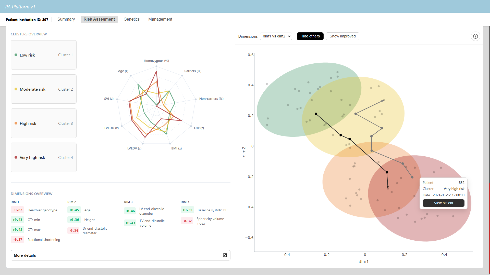
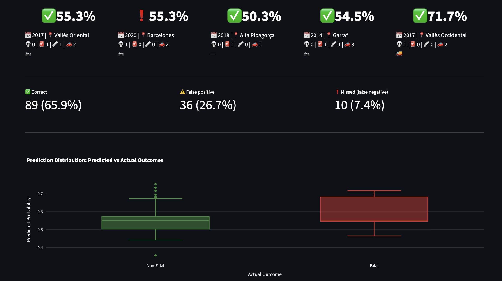
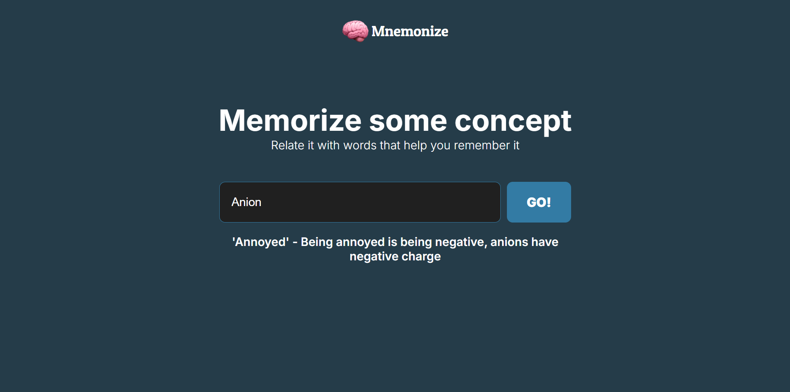

# Projects overview

A quick look at some side projects developed over the last few years.

## PA Platform (2026)

Web-based decision support system for the clinical management of patients with propionic acidemia (PA), developed in collaboration with the TransCOR research group at UPF. It includes visualization of key biomarkers, risk assessment calculators, and a cluster visualization tool. The latter presents the patient's trajectory over a clustered space, and allows to discover how similar patients were managed, providing novel insights for diseases with limited understanding.

## [Traffic accident analysis in Catalonia (2025)](https://github.com/uripont/catalan-traffic-accident-analysis)

Machine learning analysis aiming to predict mortality risk in catalan traffic accidents, developed in association with [Oriol Pont](https://github.com/uripont). Our approach combines exploratory data analysis, training and assessment of multiple machine learning models, and explainable AI techniques to understand which features matter most when predicting whether an accident will result in fatalities.

## Mnemonize (2024)

An experimental project, designed to explore the integration of LLM APIs, which helps students memorize complex concepts.

